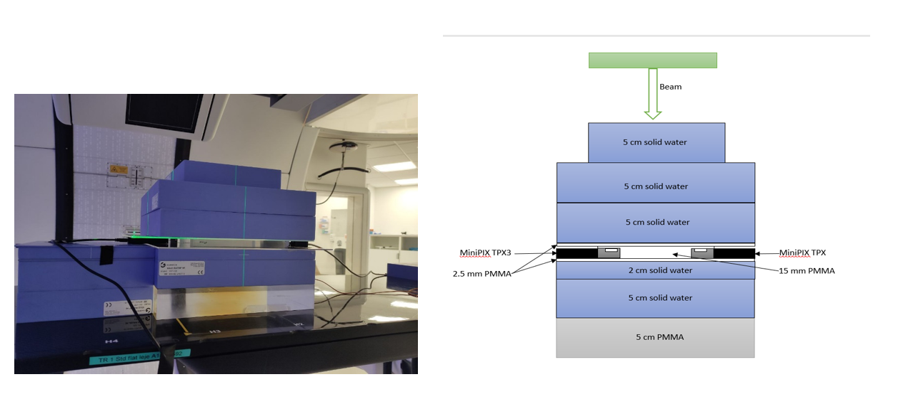
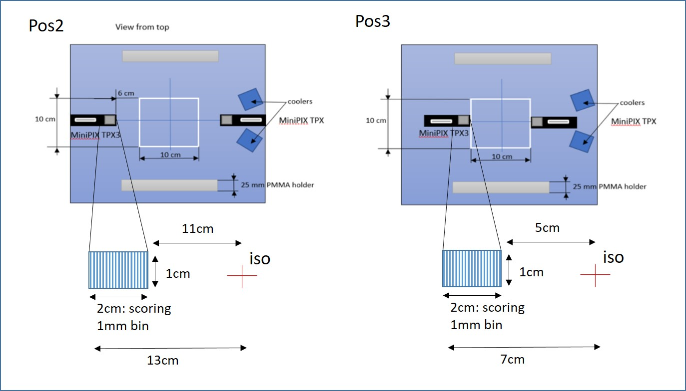

## Scoring volumes
We suggest to adhere to the list of scoring quantities and scoring volumes described below. This will allow to compare the results obtained using different MC codes.

-
### Target volume
This volume represent the detector positioned in the PMMA holder. Center of the volume is equivalent to the isocenter position. The volume is large enough to cover the whole detector.

`[-2.5, 2.5] x [-2.5, 2.5] x [-0.1, 0.1] cm³`

Lateral extension of all the fields in treatment plans is twice the size of the target volume. Plans cover the PTV of 10 x 10 x 10 cm³.

The yellow box shows the **target volume** for plan2:

